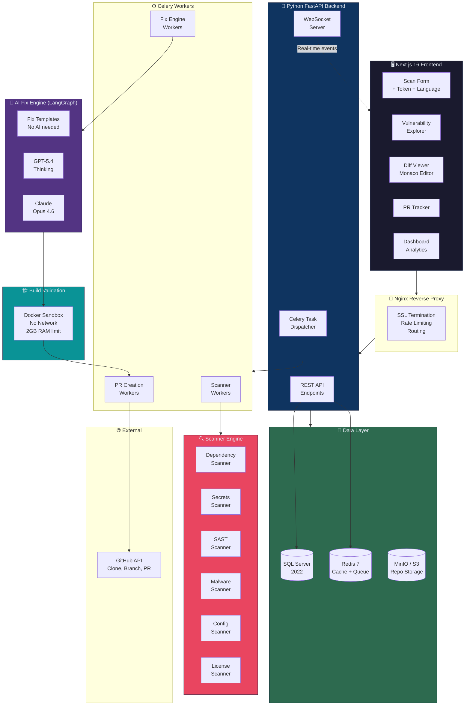
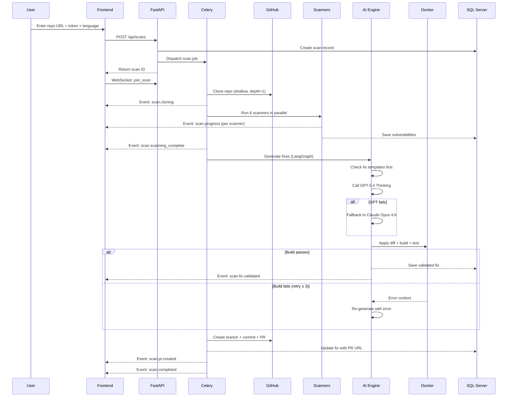
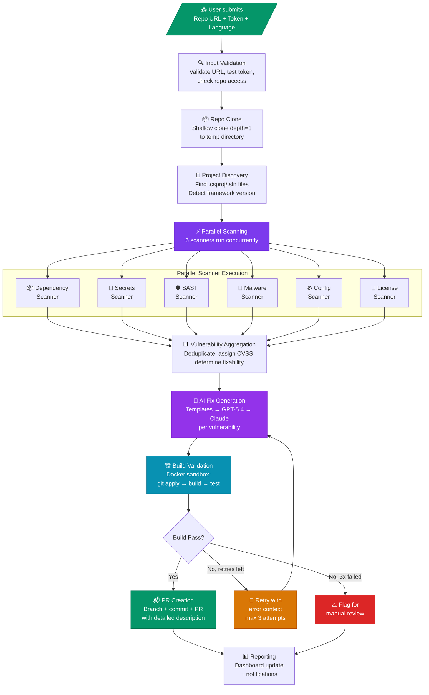
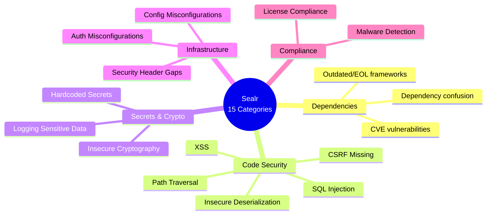
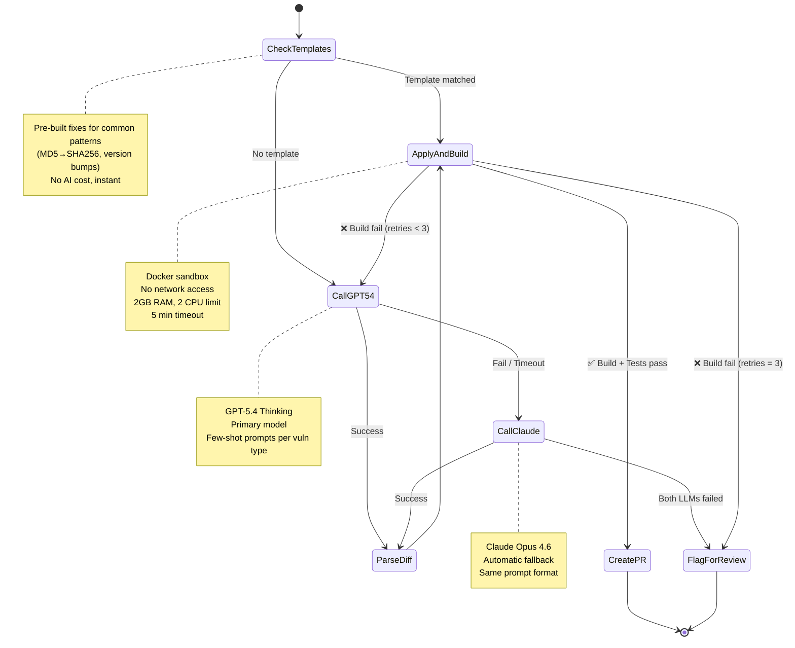
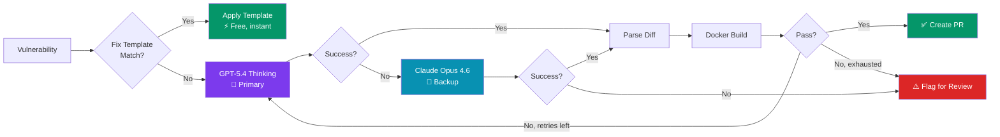
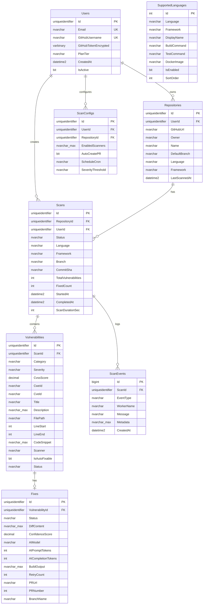
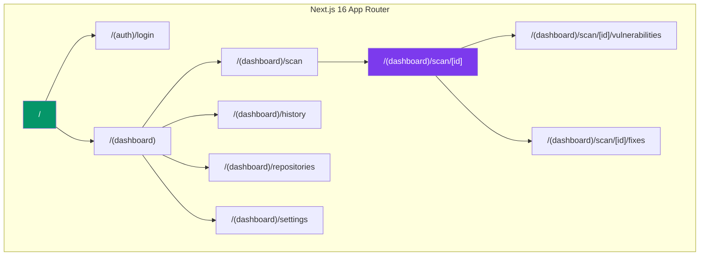
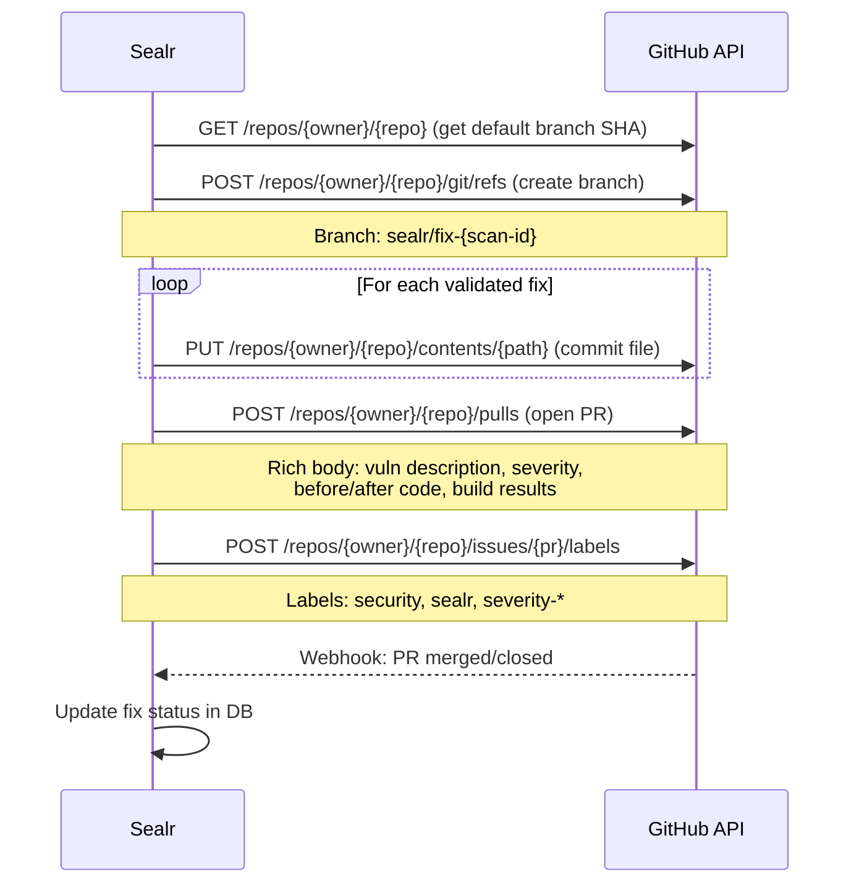
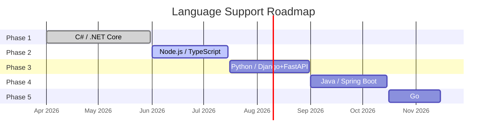

# 📋 Sealr — Technical Specification v2.0

> **GitHub Vulnerability Scanner & Auto-Fix Platform**
> Version 2.0 | March 2026 | Multi-Language (Starting with .NET Core/C#)

---

## Table of Contents

- [1. Executive Summary](#1-executive-summary)
- [2. Key Design Decisions](#2-key-design-decisions)
- [3. Technology Stack](#3-technology-stack)
- [4. System Architecture](#4-system-architecture)
- [5. Scan Pipeline](#5-scan-pipeline)
- [6. Vulnerability Coverage Matrix](#6-vulnerability-coverage-matrix)
- [7. AI Fix Engine (LangGraph)](#7-ai-fix-engine-langgraph)
- [8. Database Design (SQL Server)](#8-database-design-sql-server)
- [9. API Design](#9-api-design)
- [10. Frontend Architecture (Next.js 16)](#10-frontend-architecture-nextjs-16)
- [11. GitHub Integration](#11-github-integration)
- [12. Build Validation Sandbox](#12-build-validation-sandbox)
- [13. Security Considerations](#13-security-considerations)
- [14. Language Expansion Strategy](#14-language-expansion-strategy)
- [15. Development Roadmap](#15-development-roadmap)
- [16. Risk Mitigations](#16-risk-mitigations)
- [17. Feasibility Assessment](#17-feasibility-assessment)

---

## 1. Executive Summary

**Sealr** is a web-based platform where users provide a GitHub repository URL and a Personal Access Token. The system then:

1. 🔍 Clones the repository and detects the project structure
2. 🛡️ Runs 6 parallel scanners (dependencies, secrets, SAST, malware, config, licenses)
3. 🤖 Generates AI-powered fixes using **GPT-5.4 Thinking** (primary) + **Claude Opus 4.6** (backup)
4. 🏗️ Validates every fix by building and testing in a Docker sandbox
5. 📬 Opens Pull Requests with detailed descriptions, before/after code, and validation results

The initial release targets **.NET Core / C#**. The plugin-based architecture allows expanding to Node.js, Python, Java, and Go by adding configuration — not rewriting code.

---

## 2. Key Design Decisions

| Decision | Choice | Rationale |
|:---------|:-------|:----------|
| **Frontend** | Next.js 16.2 (App Router + Turbopack) | Latest stable, SSR, React Server Components, great DX |
| **Backend** | Python 3.12 + FastAPI | Async-first, excellent security tool ecosystem |
| **Database** | SQL Server 2022 | Enterprise-grade, Azure SQL as managed option |
| **Primary AI** | GPT-5.4 Thinking (OpenAI) | Latest frontier model, best code generation |
| **Backup AI** | Claude Opus 4.6 (Anthropic) | Automatic fallback when GPT unavailable |
| **AI Orchestration** | LangGraph | State machine for retry loops, multi-model routing |
| **Auth** | GitHub PAT (user provides token) | Simple, no OAuth app registration needed |
| **Language Selection** | UI dropdown at scan time | Extensible — user picks language/framework |
| **Task Queue** | Celery + Redis | Battle-tested Python async job processing |
| **Scanners** | Semgrep + Gitleaks + ClamAV + YARA | Open-source, production-grade tools |

---

## 3. Technology Stack

### 3.1 Frontend Stack

```
┌─────────────────────────────────────────────────────────────┐
│                    FRONTEND STACK                            │
├──────────────────┬──────────────────────────────────────────┤
│ Framework        │ Next.js 16.2 (App Router + Turbopack)    │
│ Language         │ TypeScript 5.x                           │
│ Styling          │ Tailwind CSS 4.x                         │
│ State            │ Zustand + TanStack Query v5              │
│ UI Components    │ shadcn/ui                                │
│ Code Diff        │ Monaco Editor (@monaco-editor/react)     │
│ Charts           │ Recharts                                 │
│ Real-time        │ Socket.IO client                         │
│ Forms            │ React Hook Form + Zod                    │
│ Icons            │ Lucide React                             │
└──────────────────┴──────────────────────────────────────────┘
```

### 3.2 Backend Stack

```
┌─────────────────────────────────────────────────────────────┐
│                    BACKEND STACK                             │
├──────────────────┬──────────────────────────────────────────┤
│ Framework        │ Python 3.12 + FastAPI 0.115+             │
│ ORM              │ SQLAlchemy 2.x + Alembic                 │
│ DB Driver        │ pyodbc + aioodbc (async SQL Server)      │
│ Task Queue       │ Celery 5.x + Redis 7                    │
│ AI Orchestration │ LangGraph 0.2.x                          │
│ AI Primary       │ openai SDK → GPT-5.4 Thinking            │
│ AI Backup        │ anthropic SDK → Claude Opus 4.6           │
│ HTTP Client      │ httpx (async)                            │
│ Git              │ GitPython + subprocess                   │
│ WebSocket        │ python-socketio                          │
└──────────────────┴──────────────────────────────────────────┘
```

### 3.3 Infrastructure Stack

```
┌─────────────────────────────────────────────────────────────┐
│                   INFRASTRUCTURE                             │
├──────────────────┬──────────────────────────────────────────┤
│ Database         │ SQL Server 2022 (or Azure SQL)           │
│ Cache / Queue    │ Redis 7                                  │
│ Object Storage   │ S3 / MinIO                               │
│ Build Sandbox    │ Docker + Docker-in-Docker                │
│ Reverse Proxy    │ Nginx                                    │
│ Monitoring       │ Sentry + Prometheus + Grafana            │
│ CI/CD            │ GitHub Actions                           │
└──────────────────┴──────────────────────────────────────────┘
```

### 3.4 Scanning Tools

```
┌─────────────────────────────────────────────────────────────┐
│                   SCANNING TOOLS                             │
├──────────────────┬──────────────────────────────────────────┤
│ Dependencies     │ dotnet list package --vulnerable          │
│                  │ npm audit, pip-audit, OSV API             │
│ Secrets          │ Gitleaks 8.x (regex + entropy)           │
│ SAST             │ Semgrep (custom rulesets per language)    │
│ Malware          │ ClamAV + YARA rules                      │
│ Configuration    │ Custom analyzers per framework            │
│ Licenses         │ licensee / license-checker                │
└──────────────────┴──────────────────────────────────────────┘
```

---

## 4. System Architecture

### 4.1 High-Level Architecture Diagram



### 4.2 Component Interaction Flow



---

## 5. Scan Pipeline

### 5.1 Pipeline Flow Diagram



### 5.2 Pipeline Steps Detail

| Step | Action | Duration | Output |
|:-----|:-------|:---------|:-------|
| 1️⃣ | **Input Validation** — Validate URL format, test GitHub token, verify repo access | ~2s | Validated owner/repo/branch |
| 2️⃣ | **Repo Clone** — `git clone --depth 1` to ephemeral temp directory | 5-30s | Cloned source code |
| 3️⃣ | **Project Discovery** — Find project files, detect language/framework/SDK version | ~1s | Language config |
| 4️⃣ | **Parallel Scanning** — 6 scanners run concurrently via Celery workers | 30-120s | Raw vulnerability list |
| 5️⃣ | **Aggregation** — Deduplicate, assign CVSS 3.1 scores, categorize severity | ~2s | Scored vulnerability list |
| 6️⃣ | **AI Fix Generation** — Template match → GPT-5.4 → Claude fallback per vuln | 10-60s per fix | Unified diffs |
| 7️⃣ | **Build Validation** — Apply diff in Docker, run build + test | 30-120s per fix | Pass/fail + logs |
| 8️⃣ | **PR Creation** — Create branch, commit fixes, open PR with rich description | ~5s per PR | GitHub PR URLs |
| 9️⃣ | **Reporting** — Update dashboard, send notifications | ~1s | Scan summary |

---

## 6. Vulnerability Coverage Matrix

### 6.1 All 15 Categories



### 6.2 Detailed Coverage Table

| # | Category | Severity | Scanner | Auto-Fix | CWE |
|:--|:---------|:---------|:--------|:---------|:----|
| 1 | **Dependency Vulnerabilities** | 🔴 Critical-Low | Dependency + OSV | ✅ Version bump | Various |
| 2 | **Outdated/EOL Frameworks** | 🟠 High | Dependency | ⚠️ Flag + suggest | N/A |
| 3 | **Hardcoded Secrets** | 🔴 High | Gitleaks | ✅ Extract to config | CWE-798 |
| 4 | **SQL Injection** | 🔴 Critical | Semgrep SAST | ✅ Parameterize | CWE-89 |
| 5 | **XSS** | 🟠 High | Semgrep SAST | ✅ Encode/sanitize | CWE-79 |
| 6 | **Insecure Deserialization** | 🔴 Critical | Semgrep SAST | ✅ Safe alternatives | CWE-502 |
| 7 | **Insecure Cryptography** | 🟡 Medium | Semgrep SAST | ✅ Upgrade algos | CWE-328 |
| 8 | **CSRF Missing** | 🟡 Medium | Semgrep SAST | ✅ Add attributes | CWE-352 |
| 9 | **Auth Misconfigurations** | 🟠 High | Config Scanner | ✅ Tighten config | CWE-862 |
| 10 | **Path Traversal** | 🟠 High | Semgrep SAST | ✅ Sanitize paths | CWE-22 |
| 11 | **Malware Detection** | 🔴 Critical | ClamAV + YARA | ❌ Flag for removal | CWE-506 |
| 12 | **Dependency Confusion** | 🟠 High | Dependency | ⚠️ Add source pins | N/A |
| 13 | **License Compliance** | 🟡 Medium | License Scanner | ❌ Flag for review | N/A |
| 14 | **Security Header Gaps** | 🟡 Medium | Config Scanner | ✅ Add middleware | CWE-693 |
| 15 | **Logging Sensitive Data** | 🟡 Medium | Semgrep SAST | ✅ Mask/remove | CWE-532 |

### 6.3 Language-Specific Rules (.NET Core — Phase 1)

| Vulnerability | Detection Pattern | Fix Strategy |
|:-------------|:-----------------|:-------------|
| SQL Injection | `SqlCommand` + string concat, raw `FromSqlRaw` | Parameterized queries, `FromSqlInterpolated` |
| XSS | `@Html.Raw()`, missing `HtmlEncoder` | `@Html.Encode()`, `@` Razor syntax |
| Insecure Deserialization | `BinaryFormatter`, `TypeNameHandling.All` | `System.Text.Json`, `TypeNameHandling.None` |
| Hardcoded Secrets | `"Server=..."`, `"Bearer ..."` patterns | `IConfiguration` + User Secrets / Key Vault |
| Weak Crypto | `MD5.Create()`, `SHA1.Create()`, `DES` | `SHA256`, `SHA512`, `Aes` with GCM |
| Missing CSRF | `[HttpPost]` without `[ValidateAntiForgeryToken]` | Add attribute + configure antiforgery |
| Missing Auth | `[AllowAnonymous]` on sensitive endpoints | Add `[Authorize]` with proper policies |
| Insecure Cookie | Missing `Secure`, `HttpOnly` flags | Set `Secure=true`, `HttpOnly=true`, `SameSite=Strict` |
| Open Redirect | `Redirect(userInput)` without validation | `LocalRedirect()` or URL allowlist |
| CORS Misconfig | `AllowAnyOrigin().AllowCredentials()` | Specific origins, remove credentials with wildcard |

---

## 7. AI Fix Engine (LangGraph)

### 7.1 Why LangGraph

The fix engine is **not** a single API call — it's a stateful, multi-step loop with conditional branching. LangGraph provides:

| Feature | What It Does for Sealr |
|:--------|:--------------------------|
| **Cyclic graphs** | Build fail → retry with error context → re-generate fix (loop!) |
| **Typed state** | Vulnerability, diff, build log, retry count all flow between nodes |
| **Conditional edges** | GPT success → build. GPT fail → Claude. Build fail → retry or flag. |
| **Send API** | Process 15 vulnerabilities in parallel, each with own state machine |
| **Checkpointing** | Resume from last successful node if process crashes |
| **LangSmith tracing** | Debug every LLM call, every state transition in production |

### 7.2 State Machine Diagram



### 7.3 LangGraph State Definition

```python
class FixState(TypedDict):
    # Input (immutable)
    vulnerability: dict          # category, severity, file_path, etc.
    file_content: str            # Full affected file
    language: str                # "csharp", "typescript", etc.
    framework: str               # ".NET Core", "Express", etc.
    repo_path: str               # Cloned repo location

    # Evolving state (updated by nodes)
    diff_content: Optional[str]  # Generated unified diff
    fix_explanation: Optional[str]
    confidence_score: float      # 0.0 - 1.0
    model_used: str              # "gpt-5.4-thinking" or "claude-opus-4-6"

    # Build validation
    build_passed: Optional[bool]
    build_output: Optional[str]

    # Retry tracking
    retry_count: int             # Incremented on build failure
    max_retries: int             # Default: 3
    last_error: Optional[str]    # Fed back to LLM on retry

    # Outcome
    status: str                  # "validated", "pr_created", "failed", "flagged"
    pr_url: Optional[str]
```

### 7.4 Model Routing Logic



---

## 8. Database Design (SQL Server)

### 8.1 Entity Relationship Diagram



### 8.2 Key Design Choices

| Choice | Rationale |
|:-------|:----------|
| GUID primary keys via `NEWSEQUENTIALID()` | Clustered index performance on SQL Server |
| `NVARCHAR(MAX)` for diffs and build output | Code diffs and logs can be large |
| JSON stored in `NVARCHAR` columns | Flexible metadata (scan events, scanner config arrays) |
| Async driver (`aioodbc`) | Non-blocking SQL Server access from FastAPI |
| `SupportedLanguages` table | Adding a new language = inserting one row |

---

## 9. API Design

### 9.1 REST Endpoints

| Method | Endpoint | Description |
|:-------|:---------|:------------|
| `POST` | `/api/auth/validate-token` | Validate GitHub PAT |
| `GET` | `/api/languages` | List supported languages/frameworks |
| `POST` | `/api/scans` | Create and start a new scan |
| `GET` | `/api/scans` | List scans (paginated) |
| `GET` | `/api/scans/:id` | Get scan status + summary |
| `DELETE` | `/api/scans/:id` | Cancel running scan |
| `GET` | `/api/scans/:id/vulnerabilities` | List vulns (filterable) |
| `GET` | `/api/scans/:id/fixes` | List fixes + PR status |
| `POST` | `/api/scans/:id/fix-all` | Fix all auto-fixable vulns |
| `GET` | `/api/vulnerabilities/:id` | Vulnerability detail |
| `POST` | `/api/vulnerabilities/:id/fix` | Fix single vulnerability |
| `POST` | `/api/vulnerabilities/:id/dismiss` | Dismiss vulnerability |
| `GET` | `/api/fixes/:id` | Fix detail + diff |
| `POST` | `/api/fixes/:id/create-pr` | Open GitHub PR |
| `POST` | `/api/fixes/:id/retry` | Retry fix generation |
| `GET` | `/api/repositories` | List scanned repos |
| `GET` | `/api/dashboard/stats` | Aggregate stats |
| `POST` | `/api/webhooks/github` | GitHub webhook receiver |

### 9.2 WebSocket Events

| Event | Direction | Description |
|:------|:----------|:------------|
| `scan.started` | Server → Client | Scan execution began |
| `scan.progress` | Server → Client | Per-scanner progress |
| `scan.vulnerability.found` | Server → Client | New vulnerability discovered |
| `scan.fix.generated` | Server → Client | Fix generated |
| `scan.fix.validated` | Server → Client | Build validation result |
| `scan.pr.created` | Server → Client | PR opened on GitHub |
| `scan.completed` | Server → Client | Scan fully completed |
| `scan.failed` | Server → Client | Scan failed with error |

---

## 10. Frontend Architecture (Next.js 16)

### 10.1 Route Structure



### 10.2 Key UI Components

| Component | Location | Purpose |
|:----------|:---------|:--------|
| `ScanForm` | `/scan` | Repo URL + token + language selector |
| `LanguageSelector` | `/scan` | Dropdown of supported languages/frameworks |
| `ScanProgress` | `/scan/[id]` | Real-time scan status via WebSocket |
| `VulnTable` | `/scan/[id]/vulnerabilities` | Filterable/sortable vulnerability list |
| `DiffViewer` | `/scan/[id]/fixes` | Monaco-based side-by-side diff |
| `PRStatus` | `/scan/[id]/fixes` | GitHub PR status tracking |
| `StatsCards` | Dashboard | Total scans, vulns, fix rate |
| `VulnTrendChart` | Dashboard | Vulnerabilities over time (Recharts) |

---

## 11. GitHub Integration

### 11.1 PR Workflow



---

## 12. Build Validation Sandbox

### 12.1 Docker Images per Language

| Language | Docker Image | Build | Test |
|:---------|:------------|:------|:-----|
| C# / .NET 8 | `mcr.microsoft.com/dotnet/sdk:8.0` | `dotnet build` | `dotnet test` |
| C# / .NET 9 | `mcr.microsoft.com/dotnet/sdk:9.0` | `dotnet build` | `dotnet test` |
| Node.js | `node:20-alpine` | `npm run build` | `npm test` |
| Python | `python:3.12-slim` | `pip install -r requirements.txt` | `pytest` |
| Java | `maven:3.9-eclipse-temurin-21` | `mvn compile` | `mvn test` |
| Go | `golang:1.22-alpine` | `go build ./...` | `go test ./...` |

### 12.2 Sandbox Security

```
🔒 Network:     DISABLED (network_disabled=True)
🧠 Memory:      2GB limit
⚡ CPU:          2 cores max
⏱️ Timeout:     5 minutes
📁 Filesystem:  Read-only source + writable work dir
🔐 Privileges:  No privileged mode
💀 Lifecycle:   Ephemeral — destroyed after validation
```

---

## 13. Security Considerations

| Concern | Mitigation |
|:--------|:-----------|
| **Repo Isolation** | Each clone in ephemeral Docker volume, destroyed after scan |
| **Token Encryption** | GitHub tokens encrypted at rest (AES-256-GCM) |
| **No Code Persistence** | Source code never stored permanently; only metadata + diffs |
| **Rate Limiting** | API rate limiting per user tier |
| **Sandboxed Builds** | Unprivileged containers, no network |
| **Audit Logging** | All scan actions, PR creations logged |
| **SOC2 Path** | Architecture designed with compliance in mind |

---

## 14. Language Expansion Strategy



Adding a new language requires **3 adapters + 1 DB row**:

| Adapter | Purpose | Example (.NET) |
|:--------|:--------|:---------------|
| **SAST Rules** | Semgrep rulesets for language-specific vulns | `csharp/*.yaml` |
| **Fix Templates** | Pre-built fixes for common patterns | MD5→SHA256, version bumps |
| **Build Validator** | Docker image + build/test commands | `dotnet build && dotnet test` |
| **DB Row** | `INSERT INTO SupportedLanguages` | Language config |

---

## 15. Development Roadmap

| Phase | Weeks | Key Deliverables | Effort |
|:------|:------|:----------------|:-------|
| **Phase 1: Foundation** | 1–4 | Next.js scaffold, FastAPI, SQL Server schema, GitHub clone, dependency scanner, basic dashboard | ~120h |
| **Phase 2: Core Scanning** | 5–8 | Secrets + SAST + Malware + Config + License scanners, vulnerability explorer UI | ~120h |
| **Phase 3: AI Fix Engine** | 9–12 | LangGraph state machine, GPT-5.4 + Claude, Docker validation, diff viewer | ~140h |
| **Phase 4: PR Automation** | 13–16 | PR creation, webhooks, batch fixes, scheduled scans, notifications | ~100h |
| **Phase 5: Polish** | 17–20 | Analytics, security hardening, performance, deployment, docs | ~100h |
| | | **TOTAL** | **~580h** |

---

## 16. Risk Mitigations

| Risk | Impact | Mitigation |
|:-----|:-------|:-----------|
| AI generates breaking fixes | 🔴 High | Mandatory build validation; confidence scoring; human review gate |
| GitHub API rate limits | 🟡 Medium | Conditional requests, ETags, GraphQL batching, caching |
| Large repos cause timeout | 🟡 Medium | Shallow clone, file-size limits, async processing |
| False positives overwhelm users | 🟡 Medium | Tunable severity thresholds, suppressions, ML-based reduction |
| LLM costs at scale | 🟡 Medium | Template fallback first (no AI); tiered pricing |
| Private repo security | 🔴 High | Ephemeral storage, encryption at rest, clear data retention |

---

## 17. Feasibility Assessment

### ✅ Verdict: Highly Feasible

Every component uses proven, production-grade tools:

- **Next.js 16** — latest stable with Turbopack, RSC, excellent TypeScript support
- **GPT-5.4 Thinking** — most capable code generation model (March 2026)
- **SQL Server** — enterprise-grade with Azure SQL as managed option
- **LangGraph** — production-ready orchestration for the retry/fallback loop
- **Language selector** — extensible by design; new language = 1 DB row + scanner rules
- **Build validation** — the key differentiator. If the fix doesn't compile, it doesn't ship.

The biggest engineering challenge is prompt reliability — getting from 60% to 90%+ auto-fix rate requires iterative prompt tuning and growing the fix template library. But even at 60%, the product is valuable.

---

*Sealr v2.0 — Technical Specification — March 2026*
