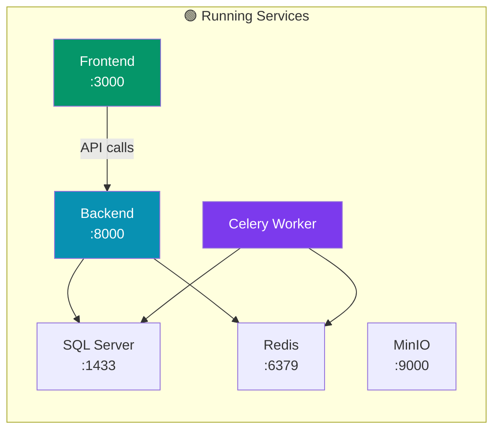
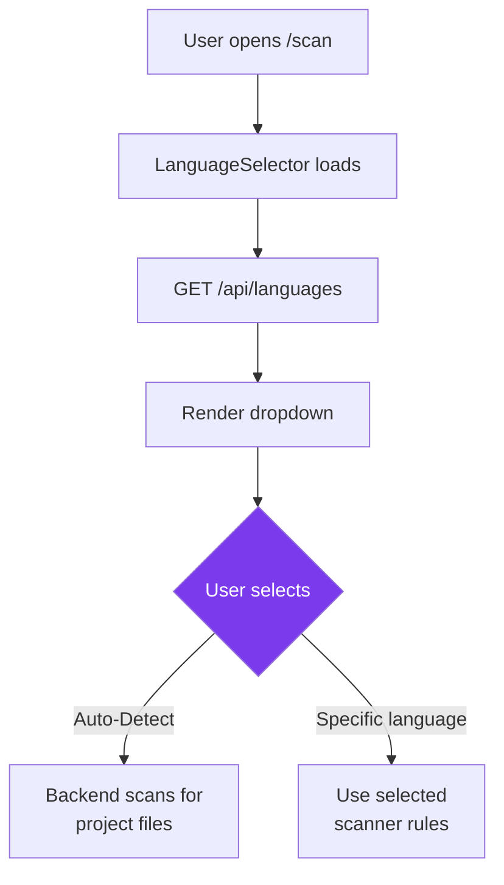
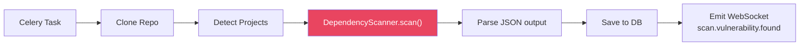
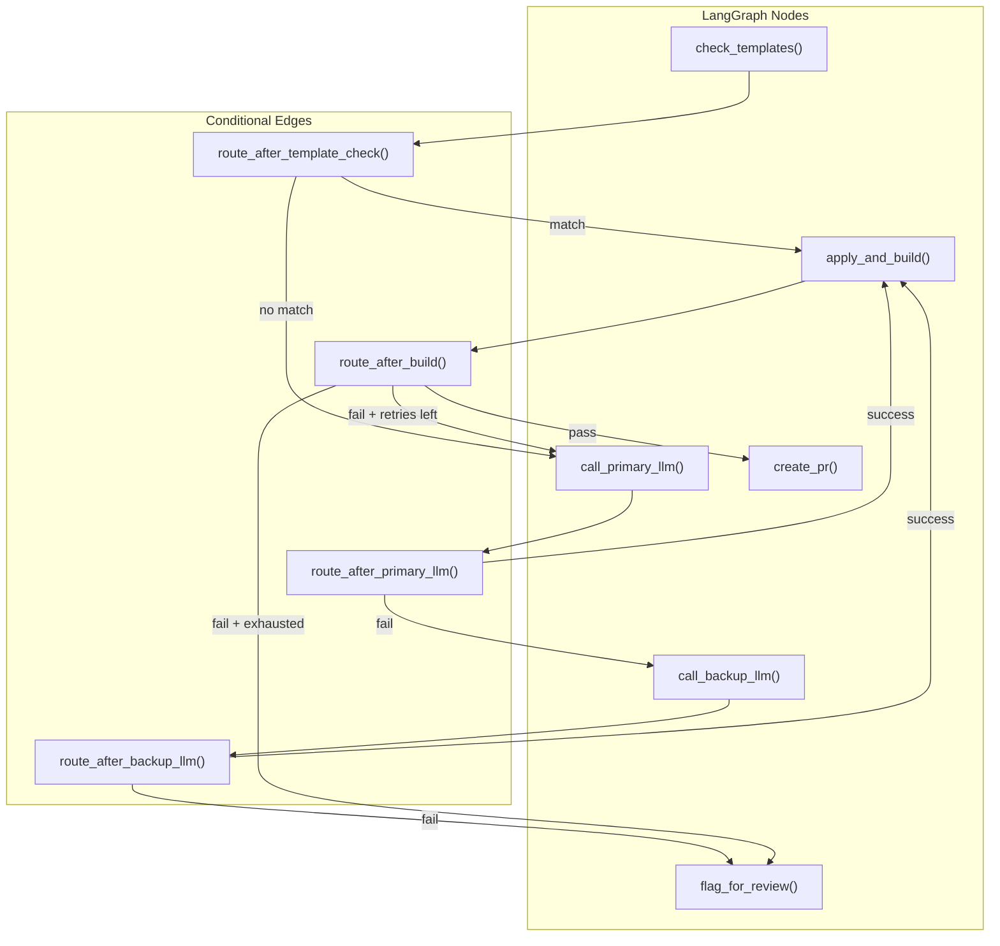
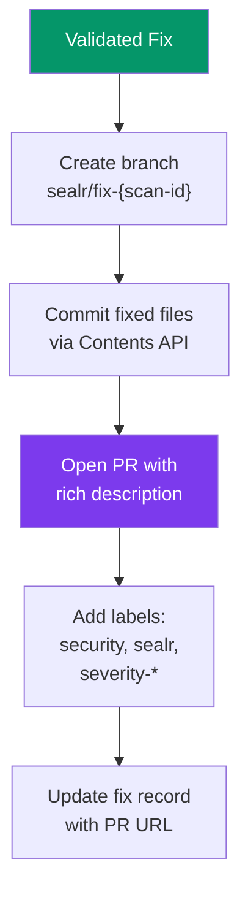

# 🛠️ Sealr — Development Guide

> Step-by-step guide to build Sealr from scratch.
> Follow each phase sequentially. Each week has concrete deliverables.

---

## Table of Contents

- [Prerequisites](#prerequisites)
- [Environment Setup](#environment-setup)
- [Phase 1: Foundation (Weeks 1–4)](#phase-1-foundation-weeks-14)
- [Phase 2: Core Scanning (Weeks 5–8)](#phase-2-core-scanning-weeks-58)
- [Phase 3: AI Fix Engine (Weeks 9–12)](#phase-3-ai-fix-engine-weeks-912)
- [Phase 4: PR Automation (Weeks 13–16)](#phase-4-pr-automation-weeks-1316)
- [Phase 5: Polish & Production (Weeks 17–20)](#phase-5-polish--production-weeks-1720)
- [Commands Reference](#commands-reference)
- [Testing Strategy](#testing-strategy)
- [Deployment Guide](#deployment-guide)

---

## Prerequisites

```
✅ Python 3.12+
✅ Node.js 20+ (LTS)
✅ Docker Desktop (with Docker Compose)
✅ Git
✅ OpenAI API key (GPT-5.4 access)
✅ Anthropic API key (Claude Opus 4.6)
✅ GitHub Personal Access Token (with `repo` scope)
```

---

## Environment Setup

### Step 1: Clone and Initialize

```bash
git clone https://github.com/your-org/sealr.git
cd sealr
cp .env.example .env
# Edit .env with your API keys
```

### Step 2: Start Infrastructure

```bash
# Start SQL Server, Redis, MinIO
docker compose -f docker/docker-compose.yml up -d

# Wait for SQL Server to be ready (~15 seconds)
sleep 15

# Verify
docker exec sealr-sqlserver /opt/mssql-tools18/bin/sqlcmd \
  -S localhost -U sa -P "Sealr@Dev123" -C -Q "SELECT 1"
```

### Step 3: Setup Database

```bash
# Create database
docker exec sealr-sqlserver /opt/mssql-tools18/bin/sqlcmd \
  -S localhost -U sa -P "Sealr@Dev123" -C \
  -Q "CREATE DATABASE sealr"

# Run initial migration
docker exec sealr-sqlserver /opt/mssql-tools18/bin/sqlcmd \
  -S localhost -U sa -P "Sealr@Dev123" -C -d sealr \
  -i /scripts/001_initial_schema.sql
```

### Step 4: Setup Backend

```bash
cd backend
python -m venv venv
source venv/bin/activate  # Windows: venv\Scripts\activate
pip install -r requirements.txt
uvicorn app.main:app --reload --port 8000
```

### Step 5: Setup Frontend

```bash
cd frontend
npm install
npm run dev
# Open http://localhost:3000
```

### Step 6: Start Celery Worker

```bash
cd backend
source venv/bin/activate
celery -A app.workers.celery_app worker --loglevel=info
```

### Architecture After Setup



---

## Phase 1: Foundation (Weeks 1–4)

### Week 1: Project Scaffolding + Database

```mermaid
gantt
    title Week 1 Tasks
    dateFormat X
    axisFormat %s

    section Backend
    FastAPI scaffold         :done, 0, 2
    SQLAlchemy models        :done, 2, 4
    Config + env setup       :done, 4, 5

    section Database
    SQL Server schema        :done, 5, 8
    Seed supported languages :done, 8, 9

    section Frontend
    Next.js 16 scaffold      :done, 0, 3
    shadcn/ui components     :done, 3, 5
    Tailwind setup           :done, 5, 6

    section Infra
    Docker Compose           :done, 6, 9
    Health check endpoints   :done, 9, 10
```



**Deliverables:**
- [ ] Backend: FastAPI app with health check at `/health`
- [ ] Database: All 8 tables created in SQL Server
- [ ] Frontend: Next.js 16 running with sidebar, header, dashboard layout
- [ ] Docker Compose: SQL Server + Redis + MinIO running
- [ ] Environment: `.env` with all config variables

### Week 2: Auth + GitHub Integration

**Tasks:**
- [ ] `POST /api/auth/validate-token` — verify GitHub PAT
- [ ] Token encryption utility (AES-256-GCM via `cryptography` lib)
- [ ] `GitHubService` class — validate token, get repo info, clone repo
- [ ] Frontend: Login page with token input
- [ ] Zustand auth store with encrypted localStorage

**Key Code: Token Validation Endpoint**
```python
@router.post("/auth/validate-token")
async def validate_token(request: TokenRequest):
    github = GitHubService(request.github_token)
    try:
        result = await github.validate_token()
        return {"valid": True, "user": result["user"]["login"]}
    except httpx.HTTPStatusError:
        raise HTTPException(401, "Invalid GitHub token")
    finally:
        await github.close()
```

### Week 3: Language Selector + Scan Form

**Tasks:**
- [ ] `GET /api/languages` — return supported languages from DB
- [ ] `LanguageSelector` component with auto-detect option
- [ ] `ScanForm` component — repo URL + token + language + branch
- [ ] `POST /api/scans` — validate input, create scan record, dispatch job
- [ ] Project discovery service for .NET (find `.csproj` / `.sln`)

**Language Selector Flow:**


### Week 4: First Scanner (Dependency)

**Tasks:**
- [ ] `BaseScanner` abstract class
- [ ] `DependencyScanner` — `dotnet list package --vulnerable`
- [ ] OSV API integration for additional CVE coverage
- [ ] Celery task for async scan execution
- [ ] WebSocket manager for real-time progress events
- [ ] Basic scan progress UI component

**Scanner Execution Flow:**


---

## Phase 2: Core Scanning (Weeks 5–8)

### Week 5: Secrets Scanner

**Tasks:**
- [ ] Install Gitleaks in Docker image
- [ ] `SecretsScanner` wrapping Gitleaks subprocess
- [ ] Custom regex patterns for .NET connection strings
- [ ] Git history scanning (configurable depth)
- [ ] Normalize Gitleaks JSON output to `VulnerabilityResult`

### Week 6: SAST Scanner

**Tasks:**
- [ ] Install Semgrep, create C# ruleset directory
- [ ] Write Semgrep rules: SQL injection, XSS, insecure deserialization, weak crypto, CSRF
- [ ] `SASTScanner` wrapping Semgrep subprocess
- [ ] Parse Semgrep JSON output with file/line locations
- [ ] Map Semgrep severity → CVSS score

**Semgrep Rule Example (SQL Injection):**
```yaml
rules:
  - id: csharp-sql-injection
    patterns:
      - pattern: new SqlCommand($CMD, ...)
      - metavariable-regex:
          metavariable: $CMD
          regex: '.*\+.*'
    message: "SQL injection via string concatenation"
    severity: ERROR
    languages: [csharp]
    metadata:
      category: sql_injection
      cwe: "CWE-89"
      auto_fixable: true
```

### Week 7: Malware + Config Scanners

**Tasks:**
- [ ] ClamAV Docker container with updated virus signatures
- [ ] YARA rules for crypto miners, reverse shells, backdoors
- [ ] `MalwareScanner` combining ClamAV + YARA
- [ ] `ConfigScanner` for `appsettings.json`, `Program.cs`
- [ ] `LicenseScanner` (NuGet license metadata)

### Week 8: Vulnerability Dashboard

**Tasks:**
- [ ] `VulnTable` component — filterable by severity, category, status
- [ ] `SeverityBadge` — color-coded severity indicators
- [ ] Scan summary cards (total vulns by severity pie chart)
- [ ] Code snippet viewer with syntax highlighting
- [ ] **Parallel scanner execution** — all 6 scanners run concurrently

**Vulnerability Explorer Wireframe:**
```
┌──────────────────────────────────────────────────────────────┐
│ Scan #abc123 — myapp                     🟢 Completed        │
├──────────────────────────────────────────────────────────────┤
│ Filters: [All Severities ▾] [All Categories ▾] [Status ▾]   │
├────┬──────────┬────────────┬────────────────────┬───────────┤
│ #  │ Severity │ Category   │ Title              │ Status    │
├────┼──────────┼────────────┼────────────────────┼───────────┤
│ 1  │ 🔴 CRIT  │ SQL Inject │ SqlCommand concat  │ 🟢 Fixed  │
│ 2  │ 🔴 CRIT  │ Malware   │ CryptoMiner found  │ ⚠️ Review │
│ 3  │ 🟠 HIGH  │ Secret    │ Hardcoded API key  │ 🟢 Fixed  │
│ 4  │ 🟡 MED   │ Crypto    │ MD5 in HashUtil    │ 🟢 Fixed  │
│ 5  │ 🟡 MED   │ CSRF      │ Missing antiforg.  │ 🔵 Open   │
└────┴──────────┴────────────┴────────────────────┴───────────┘
```

---

## Phase 3: AI Fix Engine (Weeks 9–12)

### Week 9: Fix Template System

**Tasks:**
- [ ] `fix_templates.py` with pattern matching per language
- [ ] Templates: MD5→SHA256, SHA1→SHA256, BinaryFormatter removal
- [ ] Dependency version bump automation (parse .csproj, update version)
- [ ] Template matching engine integrated into pipeline

### Week 10: LangGraph + GPT-5.4 Integration

**Tasks:**
- [ ] Install `langgraph`, `openai`, `anthropic` SDKs
- [ ] `FixState` TypedDict definition
- [ ] 6 graph nodes: check_templates, call_gpt, call_claude, parse_diff, apply_build, create_pr
- [ ] Conditional edges for routing (success/fail/retry)
- [ ] Few-shot prompt templates per vulnerability type per language
- [ ] Response parsing (extract diff, explanation, confidence score)

**LangGraph Node Implementation:**


### Week 11: Build Validation

**Tasks:**
- [ ] `BuildValidator` class with Docker SDK
- [ ] Auto-detect .NET SDK version from `global.json` / TFM
- [ ] Apply diff via `git apply` in container
- [ ] Run `dotnet restore && dotnet build && dotnet test`
- [ ] Error feedback loop (build error → retry with context)
- [ ] Container security: no network, resource limits, timeout

### Week 12: Diff Viewer + Fix Preview

**Tasks:**
- [ ] Monaco Editor integration (`@monaco-editor/react`)
- [ ] Side-by-side diff view (original vs. fixed)
- [ ] Fix detail card: explanation, confidence, model used
- [ ] "Apply Fix" / "Reject Fix" / "Retry" action buttons

---

## Phase 4: PR Automation (Weeks 13–16)

### Week 13: PR Creation



### Week 14: PR Lifecycle

- [ ] GitHub webhook receiver for PR events (merged, closed)
- [ ] Update fix status based on PR state
- [ ] PR tracker UI component
- [ ] Batch fix mode (group related fixes into single PR)

### Week 15: Scheduling + Notifications

- [ ] Celery Beat for cron-based scheduled scans
- [ ] Email notifications (SendGrid / AWS SES)
- [ ] Slack webhook integration
- [ ] Per-repo scan config UI

### Week 16: Integration Testing

- [ ] End-to-end test: scan → detect → fix → validate → PR
- [ ] Test with real .NET repos (create test repos with planted vulns)
- [ ] Performance testing with large repositories
- [ ] Error handling for all edge cases

---

## Phase 5: Polish & Production (Weeks 17–20)

### Week 17: Analytics Dashboard

- [ ] Vulnerability trend charts (Recharts)
- [ ] Fix success rate metrics
- [ ] Scan history with search/filter
- [ ] Export reports (CSV)

### Week 18: Security Hardening

- [ ] API rate limiting (per-user, per-IP)
- [ ] Input sanitization audit
- [ ] Token rotation reminders
- [ ] Comprehensive audit logging

### Week 19: Performance

- [ ] Incremental scanning (only changed files)
- [ ] Redis caching for repo metadata
- [ ] Database query optimization (execution plans, indexes)
- [ ] Frontend code splitting and lazy loading

### Week 20: Deployment

- [ ] Production Docker Compose or Kubernetes manifests
- [ ] GitHub Actions CI/CD pipeline
- [ ] SSL/TLS via Let's Encrypt
- [ ] Monitoring: Sentry (errors) + Prometheus (metrics) + Grafana (dashboards)

---

## Commands Reference

```bash
# ─── Infrastructure ───────────────────────
make infra                # Start SQL Server + Redis + MinIO
make db-setup             # Create database + run migrations

# ─── Development ──────────────────────────
make backend              # Start FastAPI (port 8000)
make frontend             # Start Next.js (port 3000)
make worker               # Start Celery worker
make dev                  # Start everything

# ─── Testing ─────────────────────────────
make test-backend         # pytest
make test-frontend        # jest
make lint                 # ruff + eslint

# ─── Database ─────────────────────────────
cd backend && alembic upgrade head     # Run migrations
cd backend && alembic revision --autogenerate -m "description"
```

---

## Testing Strategy

### Backend Tests

```
tests/
├── unit/
│   ├── test_dependency_scanner.py    # Mock subprocess
│   ├── test_secrets_scanner.py       # Mock Gitleaks output
│   ├── test_sast_scanner.py          # Mock Semgrep output
│   ├── test_fix_templates.py         # Template matching
│   ├── test_ai_fix_service.py        # Mock OpenAI/Anthropic
│   ├── test_build_validator.py       # Mock Docker SDK
│   └── test_github_service.py        # Mock GitHub API
├── integration/
│   ├── test_scan_pipeline.py         # Full scan with test repos
│   ├── test_fix_generation.py        # AI fix with real API
│   └── test_database.py              # SQL Server CRUD
└── e2e/
    └── test_full_workflow.py          # Scan → Fix → PR
```

### Test Repos

Create dedicated repos with **planted vulnerabilities**:

| Repo | Language | Planted Vulnerabilities |
|:-----|:---------|:-----------------------|
| `sealr-test-dotnet` | C# | SQLi, XSS, hardcoded secrets, vulnerable NuGet packages, MD5 usage |
| `sealr-test-node` | TypeScript | Prototype pollution, vulnerable npm packages, eval() |
| `sealr-test-python` | Python | Command injection, pickle deserialization, SSRF |

---

## Deployment Guide

### Option A: Docker Compose (Start Here)

```bash
docker compose -f docker/docker-compose.yml up -d
```

### Option B: Cloud (Scale)

| Component | AWS | Azure |
|:----------|:----|:------|
| Frontend | Vercel / CloudFront + S3 | Azure Static Web Apps |
| Backend | ECS Fargate | Azure Container Apps |
| Database | RDS SQL Server | Azure SQL Database |
| Cache | ElastiCache Redis | Azure Cache for Redis |
| Storage | S3 | Azure Blob Storage |
| CI/CD | GitHub Actions | GitHub Actions |

---

*Sealr Development Guide — Start building today.*
