# 🏗️ Sealr — Architecture Document

> Deep dive into every architectural component, data flow, and design decision.

---

## 1. System Overview

Sealr is composed of **6 major subsystems** that work together:

```mermaid
graph TB
    subgraph User["👤 User Interface"]
        direction LR
        A1["Next.js 16<br/>Dashboard"]
    end

    subgraph Orchestration["🎯 Orchestration Layer"]
        direction LR
        B1["FastAPI<br/>REST + WebSocket"]
        B2["Celery<br/>Task Queue"]
    end

    subgraph Scanning["🔍 Scanning Engine"]
        direction LR
        C1["Dependency"]
        C2["Secrets"]
        C3["SAST"]
        C4["Malware"]
        C5["Config"]
        C6["License"]
    end

    subgraph Intelligence["🤖 AI Intelligence"]
        direction LR
        D1["LangGraph<br/>State Machine"]
        D2["GPT-5.4<br/>Thinking"]
        D3["Claude<br/>Opus 4.6"]
        D4["Fix<br/>Templates"]
    end

    subgraph Validation["✅ Validation"]
        direction LR
        E1["Docker<br/>Sandbox"]
    end

    subgraph Integration["🔗 Integration"]
        direction LR
        F1["GitHub<br/>API"]
    end

    User --> Orchestration
    Orchestration --> Scanning
    Scanning --> Intelligence
    Intelligence --> Validation
    Validation --> Integration

    style User fill:#1e3a5f,stroke:#2563eb,color:#e2e8f0
    style Orchestration fill:#1e3a5f,stroke:#0891b2,color:#e2e8f0
    style Scanning fill:#4c1d95,stroke:#7c3aed,color:#e2e8f0
    style Intelligence fill:#7f1d1d,stroke:#dc2626,color:#e2e8f0
    style Validation fill:#14532d,stroke:#22c55e,color:#e2e8f0
    style Integration fill:#422006,stroke:#f59e0b,color:#e2e8f0
```

---

## 2. Request Lifecycle

Every scan follows this exact path through the system:

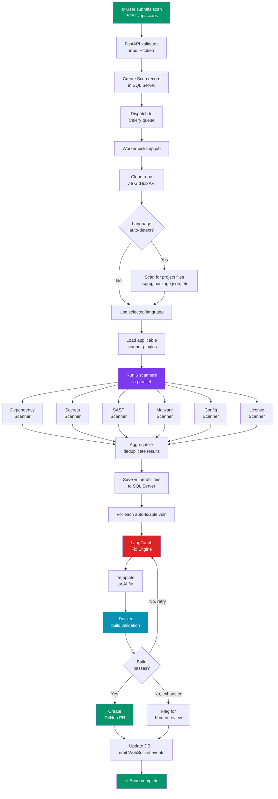

---

## 3. Scanner Architecture

### 3.1 Plugin Pattern

Each scanner implements the `BaseScanner` interface. The orchestrator loads applicable scanners based on the language/framework:

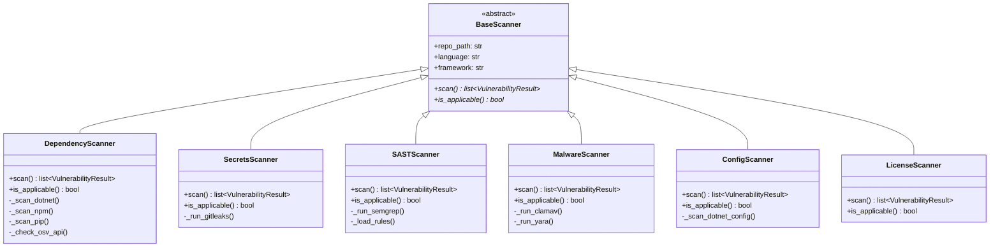

### 3.2 Scanner Data Flow

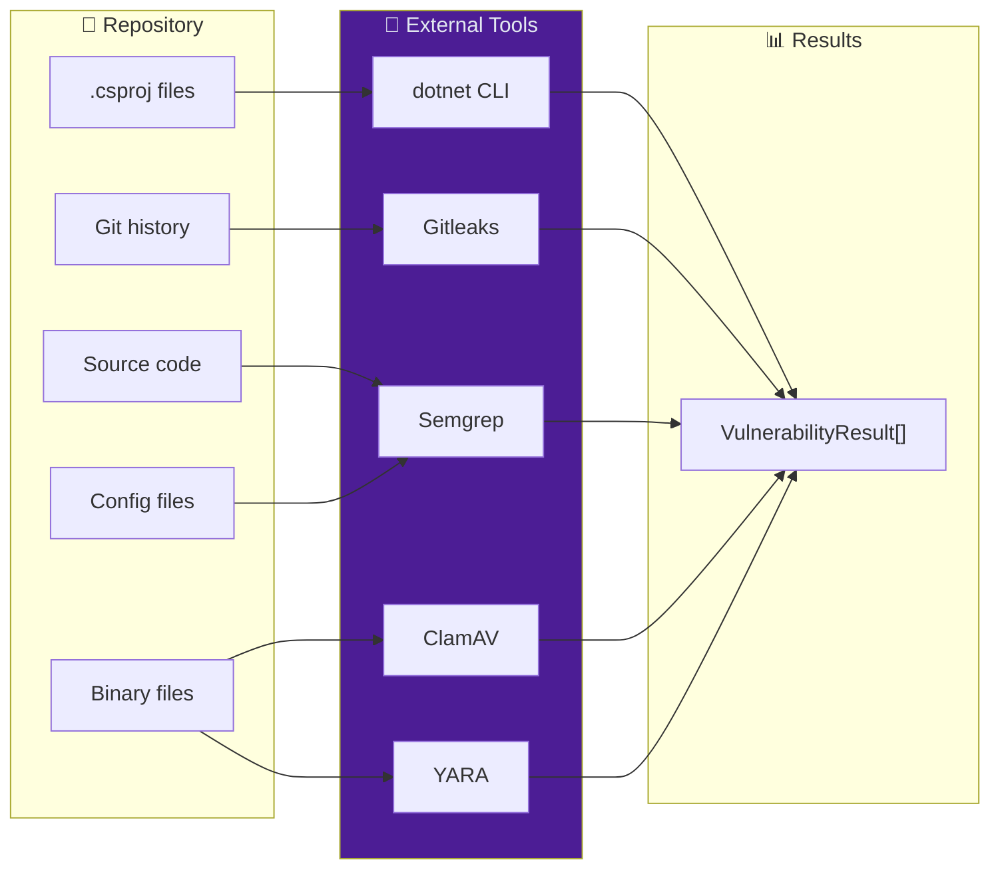

---

## 4. AI Fix Engine Architecture

### 4.1 LangGraph State Machine (Detailed)

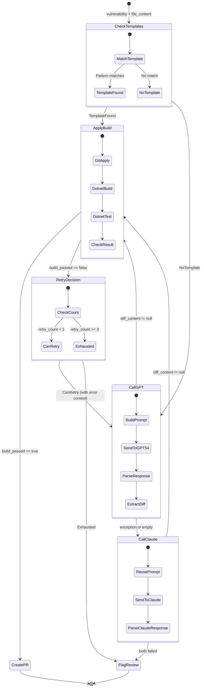

### 4.2 Prompt Engineering Strategy

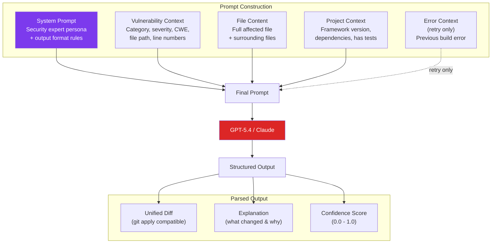

### 4.3 Cost Optimization Flow

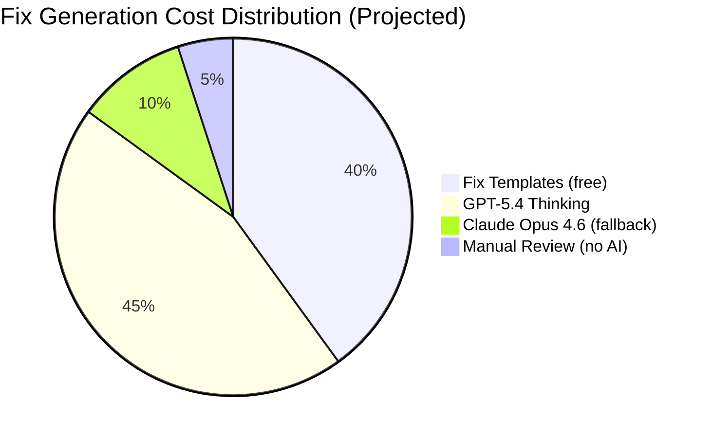

---

## 5. Data Flow Diagrams

### 5.1 Scan Data Flow

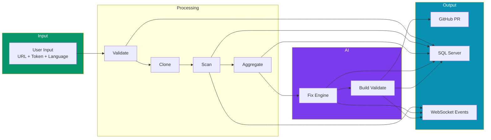

### 5.2 Real-Time Event Flow

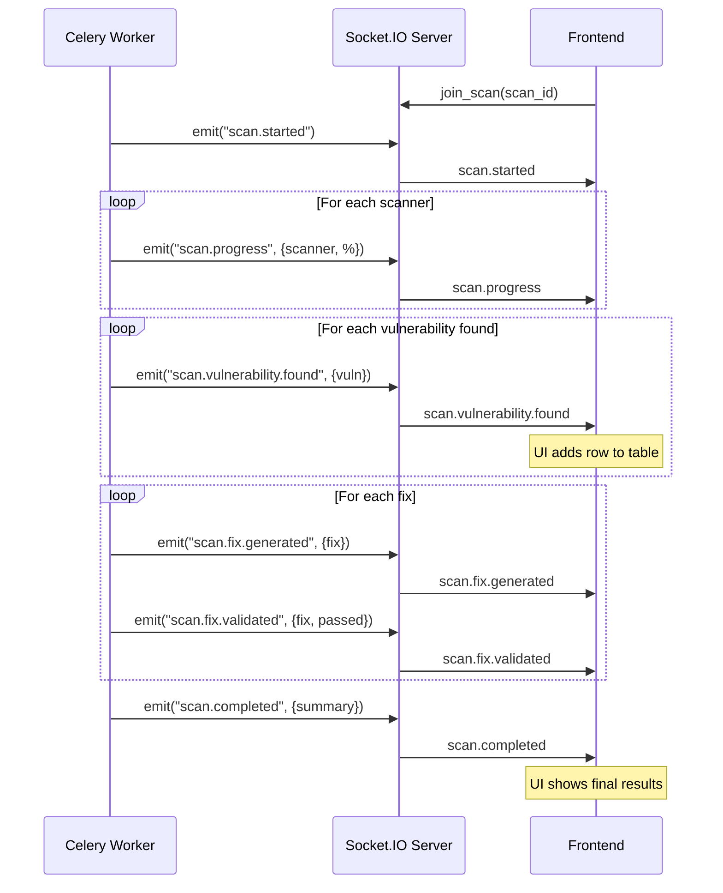

---

## 6. Security Architecture

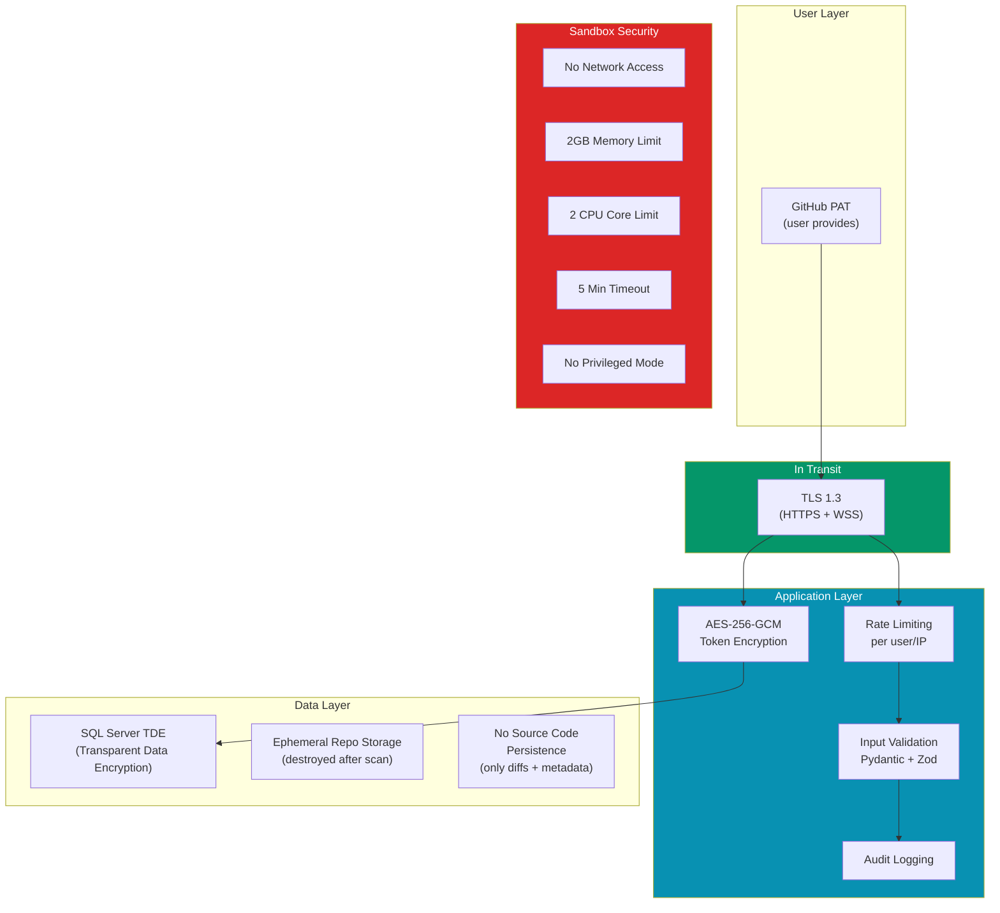

---

## 7. Deployment Architecture

### 7.1 Local Development

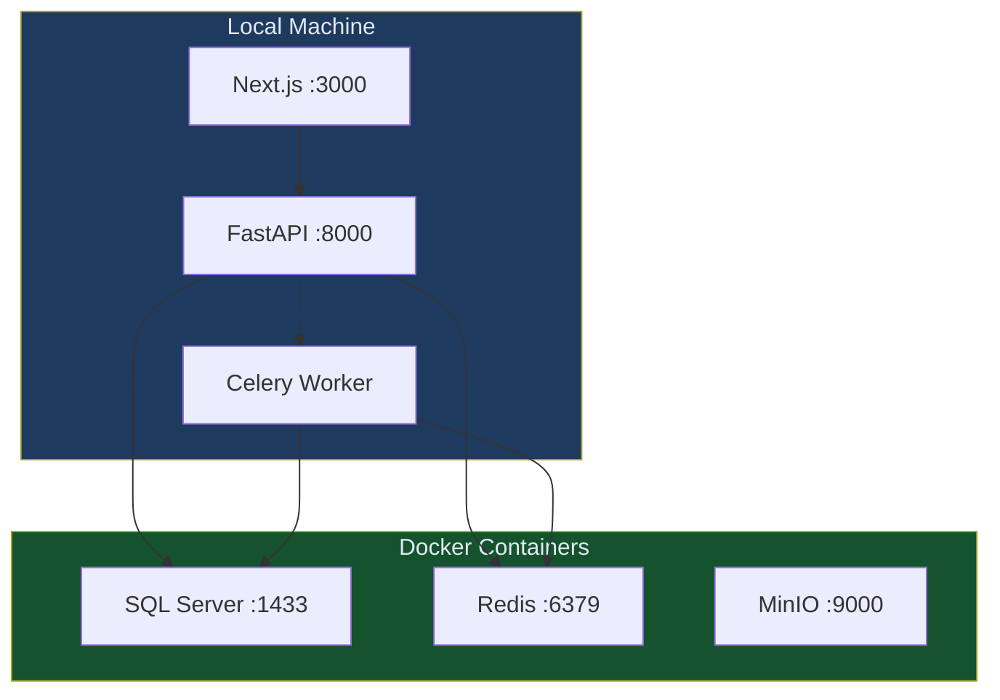

### 7.2 Production (AWS Example)

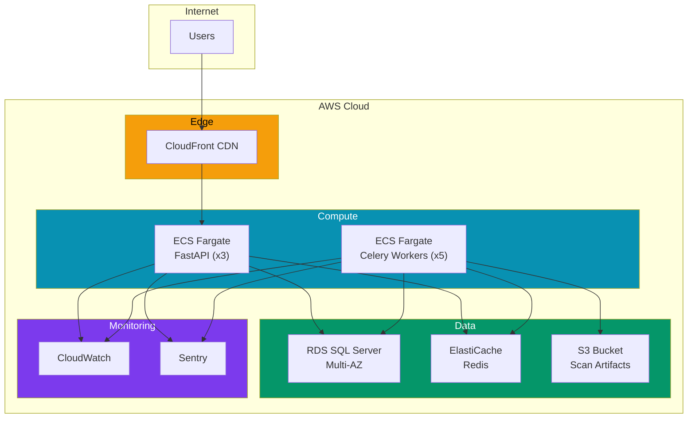

---

## 8. Technology Decision Log

| # | Decision | Options Considered | Chosen | Why |
|:--|:---------|:-------------------|:-------|:----|
| 1 | Frontend framework | React+Vite, Next.js 16, Remix | **Next.js 16** | SSR, RSC, Turbopack, App Router |
| 2 | Backend framework | Django, Flask, FastAPI | **FastAPI** | Async-first, auto OpenAPI docs, Pydantic |
| 3 | Database | PostgreSQL, SQL Server, MySQL | **SQL Server** | Project requirement, enterprise features |
| 4 | AI orchestration | Raw SDK, LangChain, LangGraph | **LangGraph** | State machine for retry loops, checkpointing |
| 5 | Primary LLM | GPT-5.4, Claude Opus, Gemini | **GPT-5.4 Thinking** | Best code generation benchmarks (Mar 2026) |
| 6 | Task queue | Celery, Dramatiq, Huey | **Celery** | Most mature Python task queue, Redis broker |
| 7 | SAST engine | Semgrep, CodeQL, SonarQube | **Semgrep** | Free, fast, custom rule authoring |
| 8 | Secrets scanner | Gitleaks, TruffleHog, detect-secrets | **Gitleaks** | Fast, comprehensive, JSON output |
| 9 | Malware scanner | ClamAV, VirusTotal | **ClamAV + YARA** | Self-hosted, no API limits, custom rules |
| 10 | Container runtime | Docker, Podman | **Docker** | Widest support, Docker-in-Docker for builds |

---

*Sealr Architecture Document — March 2026*
