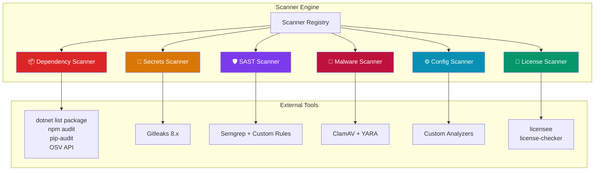

# 🔍 Sealr — Scanner Rules & Configuration

> How each scanner works, what it detects, and how to extend it.

---

## Scanner Overview



---

## 1. Dependency Scanner

### What It Detects

- Known CVEs in NuGet / npm / pip packages
- Outdated packages with available patches
- End-of-life framework versions
- Transitive dependency vulnerabilities

### Tools Used

| Language | Tool | Command |
|:---------|:-----|:--------|
| C# | dotnet CLI | `dotnet list package --vulnerable --format json` |
| Node.js | npm | `npm audit --json` |
| Python | pip-audit | `pip-audit --format json` |
| All | OSV API | `POST https://api.osv.dev/v1/query` |

### Severity Mapping

| Source Severity | Sealr Severity | CVSS Range |
|:---------------|:-------------------|:-----------|
| Critical | 🔴 Critical | 9.0 - 10.0 |
| High | 🟠 High | 7.0 - 8.9 |
| Moderate | 🟡 Medium | 4.0 - 6.9 |
| Low | 🔵 Low | 0.1 - 3.9 |

### Auto-Fix Strategy

Version bump in project file (`.csproj`, `package.json`, `requirements.txt`) to the minimum patched version.

---

## 2. Secrets Scanner

### What It Detects

- API keys (AWS, Azure, GCP, Stripe, etc.)
- Connection strings (SQL Server, MongoDB, Redis)
- JWT secrets and private keys
- OAuth tokens and refresh tokens
- Generic high-entropy strings

### Tool: Gitleaks 8.x

**400+ built-in patterns** plus custom rules for .NET-specific secrets.

### Custom Rules (Added)

```toml
# .gitleaks.toml additions for .NET
[[rules]]
id = "dotnet-connection-string"
description = "SQL Server connection string"
regex = '''(Server|Data Source)=[^;]+;.*(Password|Pwd)=[^;]+'''
tags = ["secret", "connection-string"]

[[rules]]
id = "dotnet-appsettings-secret"
description = "Secret in appsettings.json"
regex = '''"(ApiKey|Secret|Password|Token)":\s*"[^"]{8,}"'''
tags = ["secret", "config"]
```

### Scan Modes

| Mode | What It Scans | Flag |
|:-----|:-------------|:-----|
| Current tree | All files in HEAD | Default |
| Git history | Previous commits | `--log-opts=-n 50` |
| Pre-commit | Staged changes | `--pre-commit` |

---

## 3. SAST Scanner

### What It Detects

Language-specific code vulnerabilities using **Semgrep** with custom rulesets.

### Rule Directory Structure

```
backend/app/scanners/rules/
├── csharp/
│   ├── sql-injection.yaml
│   ├── xss.yaml
│   ├── crypto.yaml
│   ├── deserialization.yaml
│   ├── csrf.yaml
│   ├── auth.yaml
│   └── path-traversal.yaml
├── typescript/
│   ├── sql-injection.yaml
│   ├── xss.yaml
│   ├── prototype-pollution.yaml
│   └── redos.yaml
└── python/
    ├── sql-injection.yaml
    ├── command-injection.yaml
    ├── pickle.yaml
    └── ssrf.yaml
```

### C# Rules (Phase 1)

#### SQL Injection Rules

```yaml
rules:
  - id: csharp-sql-injection-string-concat
    patterns:
      - pattern: new SqlCommand($CMD, ...)
      - metavariable-regex:
          metavariable: $CMD
          regex: '.*\+.*'
    message: "SQL injection: SqlCommand with string concatenation"
    severity: ERROR
    languages: [csharp]
    metadata:
      category: sql_injection
      cwe: "CWE-89"
      auto_fixable: true
      fix_strategy: "Parameterized queries"

  - id: csharp-sql-injection-fromrawsql
    pattern: .FromSqlRaw($QUERY, ...)
    message: "Use FromSqlInterpolated instead of FromSqlRaw"
    severity: WARNING
    languages: [csharp]
    metadata:
      category: sql_injection
      cwe: "CWE-89"
      auto_fixable: true
      fix_strategy: "FromSqlInterpolated"

  - id: csharp-sql-injection-dapper
    pattern: connection.Query($SQL, ...)
    message: "Verify Dapper query is parameterized"
    severity: WARNING
    languages: [csharp]
    metadata:
      category: sql_injection
      cwe: "CWE-89"
```

#### Cryptography Rules

```yaml
rules:
  - id: csharp-weak-crypto-md5
    pattern: MD5.Create()
    message: "MD5 is not collision-resistant. Use SHA256."
    severity: WARNING
    metadata: { category: crypto, cwe: "CWE-328", auto_fixable: true }

  - id: csharp-weak-crypto-sha1
    pattern: SHA1.Create()
    message: "SHA1 is deprecated. Use SHA256."
    severity: WARNING
    metadata: { category: crypto, cwe: "CWE-328", auto_fixable: true }

  - id: csharp-weak-crypto-des
    patterns:
      - pattern-either:
          - pattern: DES.Create()
          - pattern: RC2.Create()
          - pattern: TripleDES.Create()
    message: "Legacy cipher. Use Aes with GCM mode."
    severity: ERROR
    metadata: { category: crypto, cwe: "CWE-327", auto_fixable: true }
```

#### Deserialization Rules

```yaml
rules:
  - id: csharp-binary-formatter
    pattern: new BinaryFormatter()
    message: "BinaryFormatter allows RCE. Use System.Text.Json."
    severity: ERROR
    metadata: { category: deserialization, cwe: "CWE-502", auto_fixable: true }

  - id: csharp-typenamehandling-all
    pattern: TypeNameHandling.All
    message: "TypeNameHandling.All enables deserialization attacks."
    severity: ERROR
    metadata: { category: deserialization, cwe: "CWE-502", auto_fixable: true }
```

### Writing Custom Rules

To add a new Semgrep rule:

1. Create a `.yaml` file in the appropriate language directory
2. Follow the Semgrep rule syntax
3. Include `metadata` with `category`, `cwe`, and `auto_fixable`
4. Test with: `semgrep --config path/to/rule.yaml path/to/test/code`

---

## 4. Malware Scanner

### What It Detects

```mermaid
mindmap
  root((Malware<br/>Detection))
    ClamAV
      Known virus signatures
      Trojan patterns
      Worm patterns
      Updated daily
    YARA Rules
      Cryptocurrency miners
        stratum+tcp://
        xmrig
        coinhive
      Reverse shells
        /bin/sh -i
        nc -e
        python socket
      Obfuscated payloads
        eval(atob())
        base64 executables
        FromBase64String
      Data exfiltration
        webhook.site
        ngrok.io
        requestbin
```

### YARA Rules File

Located at: `docker/yara-rules/malware.yar`

Includes rules for:
- **CryptoMiner** — Detects mining pool URLs and miner binaries
- **ReverseShell** — Detects shell spawning patterns
- **ObfuscatedPayload** — Detects base64-encoded executables
- **SuspiciousExfiltration** — Detects data exfiltration endpoints

### Adding New YARA Rules

```yara
rule NewThreat {
    meta:
        description = "Detects new threat pattern"
        severity = "critical"
        category = "malware"
    strings:
        $s1 = "suspicious_string" nocase
        $s2 = { 4D 5A 90 00 }  // PE header bytes
    condition:
        any of them
}
```

---

## 5. Config Scanner

### What It Detects

| Check | File | Severity |
|:------|:-----|:---------|
| Debug logging in production | `appsettings.json` | 🟡 Medium |
| Missing HTTPS redirection | `Program.cs` | 🟠 High |
| Permissive CORS policy | `Program.cs` | 🟠 High |
| Development mode in production | `appsettings.json` | 🟡 Medium |
| Missing security headers | `Program.cs` | 🟡 Medium |
| Insecure cookie settings | `Program.cs` | 🟠 High |

---

## 6. License Scanner

### What It Detects

| License Type | Risk | Action |
|:------------|:-----|:-------|
| MIT, Apache 2.0, BSD | ✅ Safe | No action |
| GPL v2, GPL v3 | ⚠️ Copyleft | Flag for review |
| AGPL | 🔴 Strong copyleft | Flag for review |
| No license | ⚠️ Unknown | Flag for review |
| Proprietary | 🔴 Restricted | Flag for review |

---

## Adding a New Language

To add support for a new language (e.g., Rust):

1. **Create Semgrep rules**: `backend/app/scanners/rules/rust/*.yaml`
2. **Add fix templates**: Update `fix_templates.py` with Rust patterns
3. **Insert DB row**:
   ```sql
   INSERT INTO SupportedLanguages
     (Language, Framework, DisplayName, ProjectFilePattern,
      BuildCommand, TestCommand, PackageManager, DockerImage, IsEnabled, SortOrder)
   VALUES
     ('rust', 'Standard', 'Rust', 'Cargo.toml',
      'cargo build', 'cargo test', 'cargo', 'rust:1.77-slim', 1, 10);
   ```
4. **Update dependency scanner** with `cargo audit` support
5. Toggle `IsEnabled = 1` → appears in UI dropdown immediately

---

*Sealr Scanner Rules — Extend and customize.*
