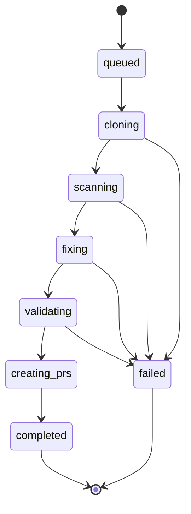
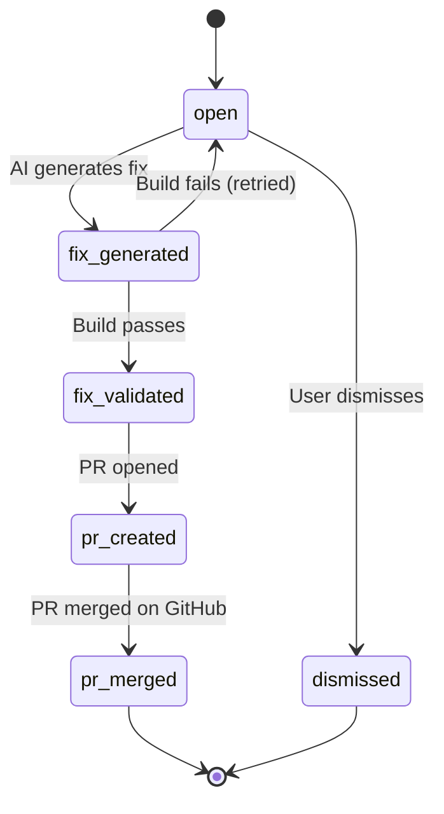
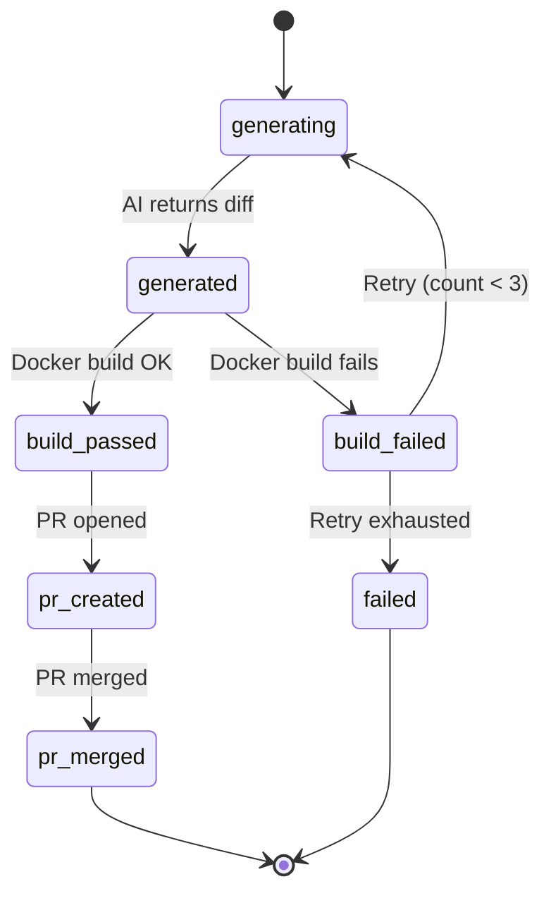

# 💾 Sealr — Database Schema & Migration Guide

> SQL Server 2022 database design, migration scripts, and query patterns.

---

## Entity Relationship Diagram

```mermaid
erDiagram
    Users ||--o{ Repositories : "owns"
    Users ||--o{ Scans : "creates"
    Users ||--o{ ScanConfigs : "configures"
    Repositories ||--o{ Scans : "scanned via"
    Scans ||--o{ Vulnerabilities : "contains"
    Scans ||--o{ ScanEvents : "logs"
    Vulnerabilities ||--o| Fixes : "fixed by"

    Users {
        uniqueidentifier Id PK
        nvarchar_255 Email UK
        nvarchar_100 GitHubUsername UK
        varbinary_max GitHubTokenEncrypted
        nvarchar_20 PlanTier
        datetime2 CreatedAt
        datetime2 UpdatedAt
        bit IsActive
    }

    Repositories {
        uniqueidentifier Id PK
        uniqueidentifier UserId FK
        nvarchar_500 GitHubUrl
        nvarchar_100 Owner
        nvarchar_100 Name
        nvarchar_100 DefaultBranch
        nvarchar_50 Language
        nvarchar_100 Framework
        datetime2 LastScannedAt
        datetime2 CreatedAt
    }

    Scans {
        uniqueidentifier Id PK
        uniqueidentifier RepositoryId FK
        uniqueidentifier UserId FK
        nvarchar_30 Status
        nvarchar_50 Language
        nvarchar_100 Framework
        nvarchar_100 Branch
        nvarchar_40 CommitSha
        int TotalVulnerabilities
        int FixedCount
        datetime2 StartedAt
        datetime2 CompletedAt
        nvarchar_max ErrorMessage
        int ScanDurationSec
        datetime2 CreatedAt
    }

    Vulnerabilities {
        uniqueidentifier Id PK
        uniqueidentifier ScanId FK
        nvarchar_50 Category
        nvarchar_20 Severity
        decimal_3_1 CvssScore
        nvarchar_20 CweId
        nvarchar_30 CveId
        nvarchar_500 Title
        nvarchar_max Description
        nvarchar_1000 FilePath
        int LineStart
        int LineEnd
        nvarchar_max CodeSnippet
        nvarchar_50 Scanner
        bit IsAutoFixable
        nvarchar_30 Status
        datetime2 CreatedAt
    }

    Fixes {
        uniqueidentifier Id PK
        uniqueidentifier VulnerabilityId FK
        nvarchar_30 Status
        nvarchar_max DiffContent
        decimal_5_2 ConfidenceScore
        nvarchar_50 AIModel
        int AIPromptTokens
        int AICompletionTokens
        nvarchar_max BuildOutput
        nvarchar_max TestOutput
        int RetryCount
        nvarchar_500 PRUrl
        int PRNumber
        nvarchar_200 BranchName
        datetime2 CreatedAt
        datetime2 ValidatedAt
    }

    ScanEvents {
        bigint Id PK
        uniqueidentifier ScanId FK
        nvarchar_50 EventType
        nvarchar_50 WorkerName
        nvarchar_500 Message
        nvarchar_max Metadata
        datetime2 CreatedAt
    }

    ScanConfigs {
        uniqueidentifier Id PK
        uniqueidentifier UserId FK
        uniqueidentifier RepositoryId FK
        nvarchar_max EnabledScanners
        bit AutoCreatePR
        nvarchar_100 ScheduleCron
        nvarchar_max ExcludedPaths
        nvarchar_20 SeverityThreshold
        datetime2 CreatedAt
    }

    SupportedLanguages {
        int Id PK
        nvarchar_50 Language
        nvarchar_100 Framework
        nvarchar_100 DisplayName
        nvarchar_200 ProjectFilePattern
        nvarchar_500 BuildCommand
        nvarchar_500 TestCommand
        nvarchar_50 PackageManager
        nvarchar_200 DockerImage
        bit IsEnabled
        int SortOrder
    }
```



---

## Status Enums

### Scan Status Flow



### Vulnerability Status Flow



### Fix Status Flow



---

## Initial Migration Script

```sql
-- File: scripts/001_initial_schema.sql
-- Run against: sealr database on SQL Server 2022

-- ======== USERS ========
CREATE TABLE Users (
    Id UNIQUEIDENTIFIER PRIMARY KEY DEFAULT NEWSEQUENTIALID(),
    Email NVARCHAR(255) NOT NULL,
    GitHubUsername NVARCHAR(100) NOT NULL,
    GitHubTokenEncrypted VARBINARY(MAX) NOT NULL,
    PlanTier NVARCHAR(20) NOT NULL DEFAULT 'free',
    CreatedAt DATETIME2 NOT NULL DEFAULT SYSUTCDATETIME(),
    UpdatedAt DATETIME2 NOT NULL DEFAULT SYSUTCDATETIME(),
    IsActive BIT NOT NULL DEFAULT 1,
    CONSTRAINT UQ_Users_Email UNIQUE (Email),
    CONSTRAINT UQ_Users_GitHubUsername UNIQUE (GitHubUsername)
);

-- ======== REPOSITORIES ========
CREATE TABLE Repositories (
    Id UNIQUEIDENTIFIER PRIMARY KEY DEFAULT NEWSEQUENTIALID(),
    UserId UNIQUEIDENTIFIER NOT NULL REFERENCES Users(Id),
    GitHubUrl NVARCHAR(500) NOT NULL,
    Owner NVARCHAR(100) NOT NULL,
    Name NVARCHAR(100) NOT NULL,
    DefaultBranch NVARCHAR(100) NOT NULL DEFAULT 'main',
    Language NVARCHAR(50) NULL,
    Framework NVARCHAR(100) NULL,
    LastScannedAt DATETIME2 NULL,
    CreatedAt DATETIME2 NOT NULL DEFAULT SYSUTCDATETIME(),
    CONSTRAINT UQ_Repos_User_Url UNIQUE (UserId, GitHubUrl)
);

-- ======== SCANS ========
CREATE TABLE Scans (
    Id UNIQUEIDENTIFIER PRIMARY KEY DEFAULT NEWSEQUENTIALID(),
    RepositoryId UNIQUEIDENTIFIER NOT NULL REFERENCES Repositories(Id),
    UserId UNIQUEIDENTIFIER NOT NULL REFERENCES Users(Id),
    Status NVARCHAR(30) NOT NULL DEFAULT 'queued',
    Language NVARCHAR(50) NOT NULL,
    Framework NVARCHAR(100) NULL,
    Branch NVARCHAR(100) NOT NULL,
    CommitSha NVARCHAR(40) NULL,
    TotalVulnerabilities INT NOT NULL DEFAULT 0,
    FixedCount INT NOT NULL DEFAULT 0,
    StartedAt DATETIME2 NULL,
    CompletedAt DATETIME2 NULL,
    ErrorMessage NVARCHAR(MAX) NULL,
    ScanDurationSec INT NULL,
    CreatedAt DATETIME2 NOT NULL DEFAULT SYSUTCDATETIME()
);
CREATE INDEX IX_Scans_UserId ON Scans(UserId);
CREATE INDEX IX_Scans_RepositoryId ON Scans(RepositoryId);
CREATE INDEX IX_Scans_Status ON Scans(Status);

-- ======== VULNERABILITIES ========
CREATE TABLE Vulnerabilities (
    Id UNIQUEIDENTIFIER PRIMARY KEY DEFAULT NEWSEQUENTIALID(),
    ScanId UNIQUEIDENTIFIER NOT NULL REFERENCES Scans(Id) ON DELETE CASCADE,
    Category NVARCHAR(50) NOT NULL,
    Severity NVARCHAR(20) NOT NULL,
    CvssScore DECIMAL(3,1) NULL,
    CweId NVARCHAR(20) NULL,
    CveId NVARCHAR(30) NULL,
    Title NVARCHAR(500) NOT NULL,
    Description NVARCHAR(MAX) NOT NULL,
    FilePath NVARCHAR(1000) NULL,
    LineStart INT NULL,
    LineEnd INT NULL,
    CodeSnippet NVARCHAR(MAX) NULL,
    Scanner NVARCHAR(50) NOT NULL,
    IsAutoFixable BIT NOT NULL DEFAULT 0,
    Status NVARCHAR(30) NOT NULL DEFAULT 'open',
    CreatedAt DATETIME2 NOT NULL DEFAULT SYSUTCDATETIME()
);
CREATE INDEX IX_Vulns_ScanId ON Vulnerabilities(ScanId);
CREATE INDEX IX_Vulns_Severity ON Vulnerabilities(Severity);
CREATE INDEX IX_Vulns_Category ON Vulnerabilities(Category);

-- ======== FIXES ========
CREATE TABLE Fixes (
    Id UNIQUEIDENTIFIER PRIMARY KEY DEFAULT NEWSEQUENTIALID(),
    VulnerabilityId UNIQUEIDENTIFIER NOT NULL REFERENCES Vulnerabilities(Id) ON DELETE CASCADE,
    Status NVARCHAR(30) NOT NULL DEFAULT 'generating',
    DiffContent NVARCHAR(MAX) NULL,
    ConfidenceScore DECIMAL(5,2) NULL,
    AIModel NVARCHAR(50) NOT NULL,
    AIPromptTokens INT NULL,
    AICompletionTokens INT NULL,
    BuildOutput NVARCHAR(MAX) NULL,
    TestOutput NVARCHAR(MAX) NULL,
    RetryCount INT NOT NULL DEFAULT 0,
    PRUrl NVARCHAR(500) NULL,
    PRNumber INT NULL,
    BranchName NVARCHAR(200) NULL,
    CreatedAt DATETIME2 NOT NULL DEFAULT SYSUTCDATETIME(),
    ValidatedAt DATETIME2 NULL
);
CREATE INDEX IX_Fixes_VulnId ON Fixes(VulnerabilityId);

-- ======== SCAN EVENTS ========
CREATE TABLE ScanEvents (
    Id BIGINT IDENTITY(1,1) PRIMARY KEY,
    ScanId UNIQUEIDENTIFIER NOT NULL REFERENCES Scans(Id) ON DELETE CASCADE,
    EventType NVARCHAR(50) NOT NULL,
    WorkerName NVARCHAR(50) NULL,
    Message NVARCHAR(500) NULL,
    Metadata NVARCHAR(MAX) NULL,
    CreatedAt DATETIME2 NOT NULL DEFAULT SYSUTCDATETIME()
);
CREATE INDEX IX_ScanEvents_ScanId ON ScanEvents(ScanId);

-- ======== SUPPORTED LANGUAGES ========
CREATE TABLE SupportedLanguages (
    Id INT IDENTITY(1,1) PRIMARY KEY,
    Language NVARCHAR(50) NOT NULL,
    Framework NVARCHAR(100) NOT NULL,
    DisplayName NVARCHAR(100) NOT NULL,
    ProjectFilePattern NVARCHAR(200) NOT NULL,
    BuildCommand NVARCHAR(500) NOT NULL,
    TestCommand NVARCHAR(500) NULL,
    PackageManager NVARCHAR(50) NOT NULL,
    DockerImage NVARCHAR(200) NOT NULL,
    IsEnabled BIT NOT NULL DEFAULT 1,
    SortOrder INT NOT NULL DEFAULT 0
);

-- Seed data
INSERT INTO SupportedLanguages VALUES
    ('csharp', '.NET Core', 'C# / .NET Core', '*.csproj;*.sln', 'dotnet build --no-restore', 'dotnet test --no-build', 'nuget', 'mcr.microsoft.com/dotnet/sdk:8.0', 1, 1),
    ('csharp', '.NET Framework', 'C# / .NET Framework', '*.csproj;*.sln', 'msbuild /restore', 'dotnet test', 'nuget', 'mcr.microsoft.com/dotnet/framework/sdk:4.8', 0, 2),
    ('typescript', 'Next.js', 'TypeScript / Next.js', 'package.json;next.config.*', 'npm run build', 'npm test', 'npm', 'node:20-alpine', 0, 3),
    ('typescript', 'Express', 'TypeScript / Express', 'package.json;tsconfig.json', 'npm run build', 'npm test', 'npm', 'node:20-alpine', 0, 4),
    ('javascript', 'Node.js', 'JavaScript / Node.js', 'package.json', 'npm run build', 'npm test', 'npm', 'node:20-alpine', 0, 5),
    ('python', 'Django', 'Python / Django', 'manage.py;requirements.txt', 'python -m py_compile', 'python manage.py test', 'pip', 'python:3.12-slim', 0, 6),
    ('python', 'FastAPI', 'Python / FastAPI', 'requirements.txt;pyproject.toml', 'python -m py_compile', 'pytest', 'pip', 'python:3.12-slim', 0, 7),
    ('java', 'Spring Boot', 'Java / Spring Boot', 'pom.xml;build.gradle', 'mvn compile', 'mvn test', 'maven', 'maven:3.9-eclipse-temurin-21', 0, 8),
    ('go', 'Go Standard', 'Go', 'go.mod', 'go build ./...', 'go test ./...', 'go modules', 'golang:1.22-alpine', 0, 9);

-- ======== SCAN CONFIGS ========
CREATE TABLE ScanConfigs (
    Id UNIQUEIDENTIFIER PRIMARY KEY DEFAULT NEWSEQUENTIALID(),
    UserId UNIQUEIDENTIFIER NOT NULL REFERENCES Users(Id),
    RepositoryId UNIQUEIDENTIFIER NULL REFERENCES Repositories(Id),
    EnabledScanners NVARCHAR(MAX) NOT NULL DEFAULT '["dependency","secrets","sast","malware","config","license"]',
    AutoCreatePR BIT NOT NULL DEFAULT 1,
    ScheduleCron NVARCHAR(100) NULL,
    ExcludedPaths NVARCHAR(MAX) NULL,
    SeverityThreshold NVARCHAR(20) NOT NULL DEFAULT 'low',
    CreatedAt DATETIME2 NOT NULL DEFAULT SYSUTCDATETIME()
);

PRINT 'Sealr schema created successfully!';
```

---

## Common Queries

### Get scan with vulnerability counts by severity

```sql
SELECT
    s.Id, s.Status, s.Language, s.Branch,
    COUNT(v.Id) AS TotalVulns,
    SUM(CASE WHEN v.Severity = 'critical' THEN 1 ELSE 0 END) AS Critical,
    SUM(CASE WHEN v.Severity = 'high' THEN 1 ELSE 0 END) AS High,
    SUM(CASE WHEN v.Severity = 'medium' THEN 1 ELSE 0 END) AS Medium,
    SUM(CASE WHEN v.Severity = 'low' THEN 1 ELSE 0 END) AS Low
FROM Scans s
LEFT JOIN Vulnerabilities v ON v.ScanId = s.Id
WHERE s.Id = @ScanId
GROUP BY s.Id, s.Status, s.Language, s.Branch;
```

### Get fix success rate

```sql
SELECT
    f.AIModel,
    COUNT(*) AS TotalFixes,
    SUM(CASE WHEN f.Status IN ('build_passed', 'pr_created', 'pr_merged') THEN 1 ELSE 0 END) AS Successful,
    CAST(SUM(CASE WHEN f.Status IN ('build_passed', 'pr_created', 'pr_merged') THEN 1 ELSE 0 END) AS FLOAT)
        / NULLIF(COUNT(*), 0) * 100 AS SuccessRate
FROM Fixes f
GROUP BY f.AIModel;
```

---

*Sealr Database Schema — SQL Server 2022*
